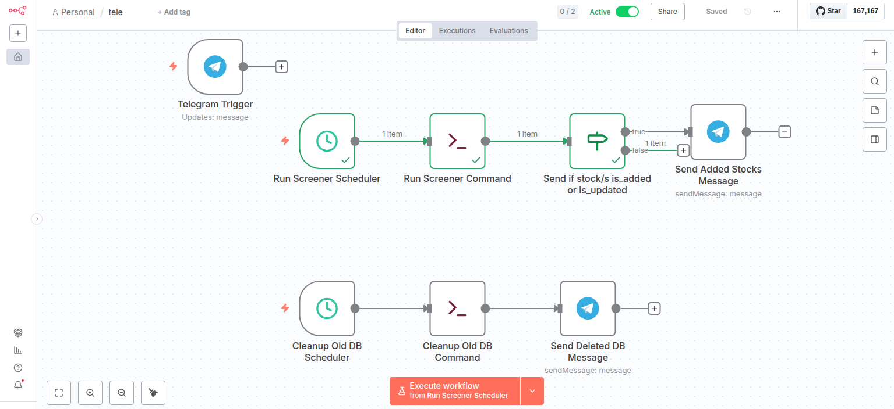

# Finviz Scarper Consumer Project

- [Finviz Scarper Consumer Project](#finviz-scarper-consumer-project)
  - [The Screener Workflow](#the-screener-workflow)
  - [API Endpoints](#api-endpoints)
    - [Health Check](#health-check)
    - [Scan Stocks](#scan-stocks)
    - [Get All Stocks](#get-all-stocks)
    - [Delete All Stocks](#delete-all-stocks)
    - [Interactive API Documentation](#interactive-api-documentation)
  - [Installation](#installation)
    - [Locally](#locally)
    - [On AWS Lightsail](#on-aws-lightsail)
  - [Usage](#usage)
  - [n8n Workflows Configuration](#n8n-workflows-configuration)
  - [Pyfinviz Service Architecture](#pyfinviz-service-architecture)
    - [Overview](#overview)
    - [Layout](#layout)
    - [Flow Explanation:](#flow-explanation)

## The Screener Workflow

- Run as a service that scrapes the Finviz screener with predefined filters and stores the results in a SQLite database.
- Keep track of scrapped data and avoid duplication.
- Get notified when a new data is added or modified.

- Schedules & Steps
  1. Before the beginning of the pre-market hours, clear the DB table.
  2. Scrape at the beginning of the pre-market hours. --> Get notified (with the full list, if any)
  3. Scrape every 5 min starting from the pre-market hours and until the end of after-market hours.
     2.1 compare the ticker,
     ```plain
      if exists
          check news_title
          if news_title changes:
              update the whole row and append to the updated list --> Get notified (with updated ticker)
          else:
              Append to the unchanged list.
      else:
          Append the new row to the added list. --> Get notified (with appended ticker)
     ```

## API Endpoints

The service exposes a REST API with the following endpoints:

### Health Check

**`GET /health`**

Check if the service is running.

**Response:**

```json
{
  "status": "ok"
}
```

---

### Scan Stocks

**`GET /scan`**

Triggers the stock screener to scan Finviz with predefined filters and stores results in the database. Returns a summary of changes (added, updated, unchanged stocks).

**Response:**

```json
{
  "added": [
    {
      "ticker": "AAPL",
      "company": "Apple Inc.",
      "country": "USA",
      "sector": "Technology",
      "industry": "Consumer Electronics",
      "shares_float": "15.3B",
      "short_interest": "0.85%",
      "relative_volume": "1.23",
      "volume": "52.4M",
      "price": "175.43",
      "change": "+2.15%",
      "news_time": "Jan-07-26 02:30PM",
      "news_title": "Apple announces new product line"
    }
  ],
  "updated": [],
  "unchanged": []
}
```

---

### Get All Stocks

**`GET /stocks`**

Returns all stocks currently stored in the database.

**Response:**

```json
{
  "stocks": [
    {
      "ticker": "AAPL",
      "company": "Apple Inc.",
      "country": "USA",
      "sector": "Technology",
      "industry": "Consumer Electronics",
      "shares_float": "15.3B",
      "short_interest": "0.85%",
      "relative_volume": "1.23",
      "volume": "52.4M",
      "price": "175.43",
      "change": "+2.15%",
      "news_time": "Jan-07-26 02:30PM",
      "news_title": "Apple announces new product line"
    }
  ]
}
```

---

### Delete All Stocks

**`DELETE /stocks`**

Deletes all stocks from the database.

**Response:**

```json
{
  "message": "Stocks deleted successfully"
}
```

**Error Response (500):**

```json
{
  "detail": "Error message"
}
```

---

### Interactive API Documentation

Once the service is running, you can access:

- **Swagger UI**: `http://localhost:8000/docs`
- **ReDoc**: `http://localhost:8000/redoc`

## Installation

### Locally

- Dependencies are docker, docker-compose (optional) and ngrok.

### On AWS Lightsail

- Create a machine with required dependencies installed. NOTE, create the ssh key pair beforehand.

```bash
aws lightsail create-instances \
    --instance-names screener \
    --bundle-id micro_3_0 \
    --region eu-west-1 \
    --availability-zone eu-west-1a \
    --blueprint-id ubuntu_22_04 \
    --key-pair-name lightsail_ir \
    --user-data '#!/bin/bash

set -x

apt-get update -y
apt-get install -y ca-certificates curl gnupg lsb-release

sudo apt-get update
sudo apt-get -y install ca-certificates curl gnupg
sudo mkdir -m 0755 -p /etc/apt/keyrings
curl -fsSL https://download.docker.com/linux/ubuntu/gpg | sudo gpg --dearmor -o /etc/apt/keyrings/docker.gpg
echo "deb [arch=$(dpkg --print-architecture) signed-by=/etc/apt/keyrings/docker.gpg] https://download.docker.com/linux/ubuntu $(lsb_release -cs) stable" | sudo tee /etc/apt/sources.list.d/docker.list > /dev/null
sudo apt-get -y update
sudo apt-get -y install docker-ce docker-ce-cli containerd.io

sudo systemctl enable docker.service
sudo systemctl enable containerd.service

sudo groupadd docker || true
sudo usermod -aG docker ubuntu
echo "Log out and log back in so that your group membership is re-evaluated."

sudo curl -SL "https://github.com/docker/compose/releases/download/1.29.2/docker-compose-$(uname -s)-$(uname -m)" -o /usr/local/bin/docker-compose
sudo chmod +x /usr/local/bin/docker-compose
docker-compose --version

# Install ngrok and authentication for Linux
curl -sSL https://ngrok-agent.s3.amazonaws.com/ngrok.asc \
  | sudo tee /etc/apt/trusted.gpg.d/ngrok.asc >/dev/null \
  && echo "deb https://ngrok-agent.s3.amazonaws.com bookworm main" \
  | sudo tee /etc/apt/sources.list.d/ngrok.list \
  && sudo apt update \
  && sudo apt install ngrok

# Get your authtoken from https://dashboard.ngrok.com/
# Run the following command to add your authtoken to the default ngrok.yml
NGROK_AUTHTOKEN=""
ngrok config add-authtoken ${NGROK_AUTHTOKEN}

# Set timezone to NY for simpler cron
sudo timedatectl set-timezone America/New_York
' \
--tags key=ENV,value=PROD key=PROJECT,value=SCREENER
```

## Usage

- After spinning up a VPS, pull images

```bash
docker pull nurhanhasan/my-n8n-with-docker:v0.2
docker pull nurhanhasan/my-pyfinviz:v0.4
```

- Create a persistent volume and network, if docker command will be used

```bash
docker volume create n8n_data
# Optional
docker network create my_n8n_network
```

- Run ngrok
<!-- TODO: Run ngrok as a service/cron job -->

```bash
ngrok http 5678

# Or better
nohup ngrok http 5678 > ngrok.log 2>&1 &
```

- scp the n8n docker-compose.yml to the VPS, or create a container with proper ENVs and volumes

```bash
docker run -d \
  --name n8n \
  -u $(id -u):$(getent group docker | cut -d: -f3) \
  --network my_n8n_network \
  -p 5678:5678 \
  -e WEBHOOK_URL=https://<the_ngrok_url> \
  -e NEWS_DATE_TODAY=true \
  -v n8n_data:/home/node/.n8n \
  -v /var/run/docker.sock:/var/run/docker.sock \
  -v /home/ubuntu:/app/workflows \
  --restart unless-stopped \
  nurhanhasan/my-n8n-with-docker:v0.2
```

- Run pyfinviz. Make sure to run both containers in the same network.

```bash
docker run -d \
  --name pyfinviz \
  --network my_n8n_network \
  -p 4000:4000 \
  -e NEWS_DATE_TODAY=true \
  -v pyfinviz_data:/app/db_results \
  --restart unless-stopped \
  nurhanhasan/my-pyfinviz:v1.0.0
```

- Access n8n at `http://<the_ngrok_url>`

- Import the n8n workflows from the `n8n_workflows.json` file.
<!-- TODO: Add import workflow by command, if possible. -->

- Activate the workflow.


## n8n Workflows Configuration

- Since the US stock market has 3 trading sessions as follows

  - Pre-market trading session 4:00 AM - 9:30 AM
  - Regular market trading session 9:30 AM - 4:00 PM
  - After-hours trading session 4:00 PM - 8:00 PM

- So, we'll need to set a scheduler trigger with cron to start with the pre-market until the end of after-market hours.

  ```plain
  Cairo time
  */5 11-23 * * 1-5
  +
  */5 0-4 * * 1-5

  OR

  ET Time (New York time)
  */5 04-20 * * 1-5
  ```

- We'll need 2 parallel workflows,
  1. the first is to delete the previous day's DB file. Hit the endpoint `/stocks` to delete the DB file.

  ```bash
  curl -X 'DELETE' \
    'http://pyfinviz:4000/stocks' \
    -H 'accept: application/json'
  ```

  Old way:

  ```bash
  # Delete old DB file. Runs daily at 4 AM
  docker rm pyfinviz2 pyfinviz > /dev/null 2>&1
  docker run -p 4000:4000 -v pyfinviz_data:/app/db -e NEWS_DATE_TODAY="true" --name pyfinviz nurhanhasan/my-pyfinviz:v0.4 rm db/screener_results.db
  ```


2. The second is to run the screener every 5 min from 4 AM to 8 PM ET. Hit the endpoint `/scan` every 5 min.

  ```bash
  curl -X 'GET' \
    'http://pyfinviz:4000/scan' \
    -H 'accept: application/json'
  ```

  Old way:

  ```bash
  # ET Time (New York time) */5 04-20 * * 1-5
  docker rm pyfinviz2 pyfinviz > /dev/null 2>&1
  docker run -p 4000:4000 -v pyfinviz_data:/app/db -e NEWS_DATE_TODAY="true" --name pyfinviz2 nurhanhasan/my-pyfinviz:v0.4
  ```





## Pyfinviz Service Architecture

### Overview

- This is a service that uses pyfinviz to screener stocks and stores the results in a SQLite database.
- It has a REST API to get the results and delete the database.
- NOTE: This service follows the Hexagonal (Ports and Adapters) Architecture. It is over-engineered for the learning purpose.

### Layout

```plain
├── app
│
│   ├── adapters                         # Adapters layer: glue between the outside world and the application core
│   │
│   │   ├── inbound                         ## Inbound adapters (how the world talks to the app)
│   │   │
│   │   │   └── api
│   │   │       ├── __init__.py
│   │   │       └── screener_controller.py      ### FastAPI route handlers (HTTP → use case)
│   │   │                                       ### Validates request, calls use case, maps result → HTTP response
│   │
│   │   └── outbound                        ## Outbound adapters (how the app talks to the world)
│   │       │
│   │       ├── datastore
│   │       │   ├── __init__.py
│   │       │   ├── datastore_adapter.py        ### SQLite repository implementation. Implements stocks_port.py (CRUD on stocks)
│   │       │                                   ### Contains SQL and persistence logic
│   │       │
│   │       └── pyfinviz
│   │           ├── __init__.py
│   │           └── pyfinviz_adapter.py         ### Adapter over pyfinviz library. Extends pyfinviz Screener functionalities.
│   │                                           ### Returns domain entities (Stock), not pyfinviz objects.
│
│
│   ├── application                      # Application core (business logic, no frameworks)
│   │
│   │   ├── models                          ## Domain entities (e.g. Stock)
│   │   │   ├── entities.py                     ### Pure business objects, no FastAPI, no pydantic.
│   │
│   │   ├── ports                           ## Input/output abstractions (e.g. screener_port.py)
│   │   │   ├── inbound
│   │   │   │   └── screener_port.py            ### Interface for screener use cases.
│   │   │   │                                   ### Implemented by screener_service
│   │   │   │
│   │   │   └── outbound
│   │   │       ├── pyfinviz_port.py            ### Interface describing what the app needs from a screener provider
│   │   │       │                               ### Implemented by pyfinviz_adapter
│   │   │       │
│   │   │       └── stocks_port.py              ### Interface for stock persistence (scan, list, delete)
│   │   │                                       ### Implemented by datastore_adapter
│   │
│   │   └── services                            ## Use cases
│   │       ├── __init__.py
│   │       └── stock_screener_use_cases.py     ### Use case implementation
│   │                                           ### Orchestrates screener + persistence
│   │                                           ### Contains application rules, not IO details
│
│   ├── infrastructure                    # Wiring & technical configuration (not business logic)
│   │   └── configs
│   │       ├── config.py                       ### Environment/config loading
│   │                                           ### Used only by adapters and dependency wiring
│
│   │   └── dependencies.py                     ### Composition root
│   │                                           ### Wires adapters to ports and ports to use cases
│   │                                           ### Used by FastAPI Depends()
│
├── main.py                               # Main application entry point
```

### Flow Explanation:

```plain
GET /stocks flow example

Inbound Adapters/handlers (api /stocks) (adapters/inbound/api)
  ↓
Use Case (AllStocksUseCase depends on AllStocksPort, constructed by dependencies.py)
    (application/services/stock_screener_use_cases.py)
  ↓
Outbound Port interface (AllStocksPort)
    (application/ports/outbound/stocks_port.py)
  ↓
Outbound Datastore Adapter (SqliteAllStocksRepository)
    (adapters/outbound/datastore_adapter.py)
  ↓
  DB
  ↓
Outbound Adapter returns domain objects (AllStocks)
  ↓
Use Case
  ↓
Inbound Adapter converts domain objects → HTTP response
  ↓
HTTP Response
```

- Entities define business/domain objects/entities.
- API handlers declare dependencies to receive fully constructed use cases (via Depends).
- APIs handlers depend on use cases to get domain entities and return HTTP responses.
- Use cases depend on ports to request external data/behavior.
- Ports define interfaces to be implemented by adapters.
- Adapters implement ports using infrastructure details and translate results into domain entities.
